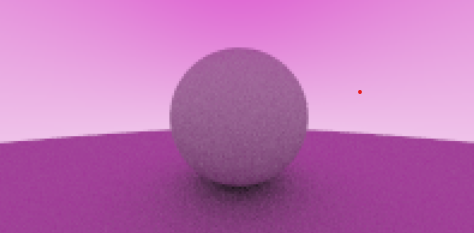

# simplex
Simple software - ray tracer made with no third party Api's. Based on Peter Shirley's Ray tracing in a weekend book.

# building
Use the build.bat file in the bin directory to build + run the executable. The output PPM file will also be in the directory.

# samples

